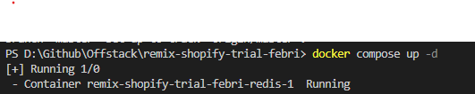

# Welcome to Remix!

- [Remix Docs](https://remix.run/docs)

## Installing

From your terminal:
```sh
npm install
```


## Configuration

First, rename .env.example file to .env
```sh
SHOPIFY_STORE="your shopify store name"
SHOPIFY_STOREFRONT_ACCESS_TOKEN="your shopify access store token"
```

skip this step if you already did this

- Install docker https://docs.docker.com/desktop/install/windows-install/ 
```sh
*note: follow WSL2 configuration if you using Windows
```

- Install redis https://hub.docker.com/_/redis


## Development    
- Run redis image on your docker
=
From your terminal remix project:
```sh
docker compose up -d
```


```sh
npm run dev
```
